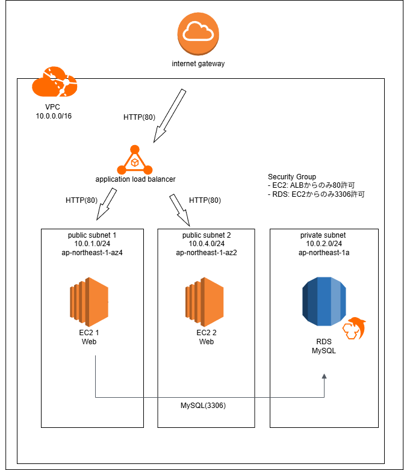

# aws-3tier-architecture
# AWS 3層Webアーキテクチャ構築

## ■ 概要

AWS環境にて、VPC・EC2・RDS・ALBを用いた3層Webシステムを構築しました。

## ■ 構成

* VPC
* EC2（Webサーバ）
* RDS（MySQL）
* ALB（ロードバランサ）

## ■ 構成図

## ■ 工夫点

* セキュリティ

  * EC2を直接インターネット公開せず、ALB経由でアクセス
  * RDSはプライベートサブネットに配置

* 可用性

  * ALBを使用し、複数AZに対応

* ネットワーク設計

  * パブリックサブネットとプライベートサブネットを分離

## ■ 学んだこと

* VPC設計（CIDR、サブネット分割）
* セキュリティグループの設定
* AWSでのWeb3層構成の基本

## ■ 今後の改善

* Auto Scalingの導入
* HTTPS対応（SSL/TLS）
* CI/CDの導入
